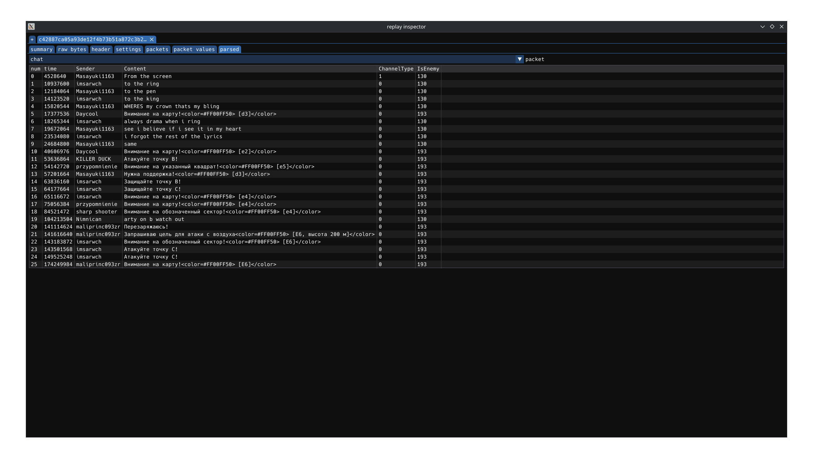

# wrpl-inspector

A golang library and dear-imgui ui to explore War Thunder replay format

## Usage

1. Clone the repo
2. `go build` (requires golang toolchain installed)
3. Run `wrpl-inspector` executable

## Capabilities

> [!IMPORTANT]
> Information provided may be incomplete/innacurate.
> If you want to propose imporvements feel free to open issue, pull request or contact me via Discord @flexcoral (343418440423309314) ([invite](https://discord.com/invite/DFsMKWJJPN)).

- Opening multiple individual replay files at the same time
- Downloading server replay from session ID
- Opening segmented server replay and combining them
- Parsing most of the static binary header
- Showing settings BLK (if present) (via `wt_ext_cli`)
- Showing results BLK (if present) (via `wt_ext_cli`)
- Opening and parsing packet stream
- Parsing chat packets
- Parsing award packets

## TODOs

- Replace `wt_ext_cli` that is used for BLK parsing (potential massive speed gains on replay opening, BLK chunks were noticed within packets themselves so it will be a pain to read them with external tooling)
- Make sense of movement packets (type 2 "AircraftSmall")
- Add exporting options for packets (csv/tsv/sqlite?)
- Improve replay opening experience, tree view location (directory) > session > files
- Packet diffing, generally capability for easier comparing of packets from replay to replay
- Potentially syncing packets and video stream for better context awareness in packet view

## Credits

This project would've not been here if StatShark devs didn't troll me in their discord, but on a serious note big thanks to:
- [Sgambe33's WT-Plotter](https://github.com/Sgambe33/WT-Plotter) (C++) (general motivation, head start)
- [wt_blk](https://github.com/Warthunder-Open-Source-Foundation/wt_blk) (Rust) (parsing BLK blobs)
- [llama-for3ver's wt_replay_decoder](https://github.com/llama-for3ver/wt_replay_decoder) (Rust) (parsing packet stream)

## License

Both ui and lib (wrpl) are under GNU Affero General Public License v3

Due to how lazy I am parsing of the BLK format is currently done via `wt_ext_cli`
from Warthunder-Open-Source-Foundation that is licensed under Apache-2.0. Binary is
Linux ELF and will have to be swapped out if ran on different OS.

In repository root there is a TTF font (HackNerdFontMono-Regular.ttf) that is
not part of wrpl-inspector distribution and is provided for easier setup until
cimgui-go figures out the backends so that default font renders all the utf segments.
It is licensed with Bitstream-Vera and MIT.

wrpl-inspector and wrpl library are not affiliated with or endorsed by
Gaijin Entertainment. War Thunder is a registered trademark of Gaijin Entertainment. All rights reserved.
