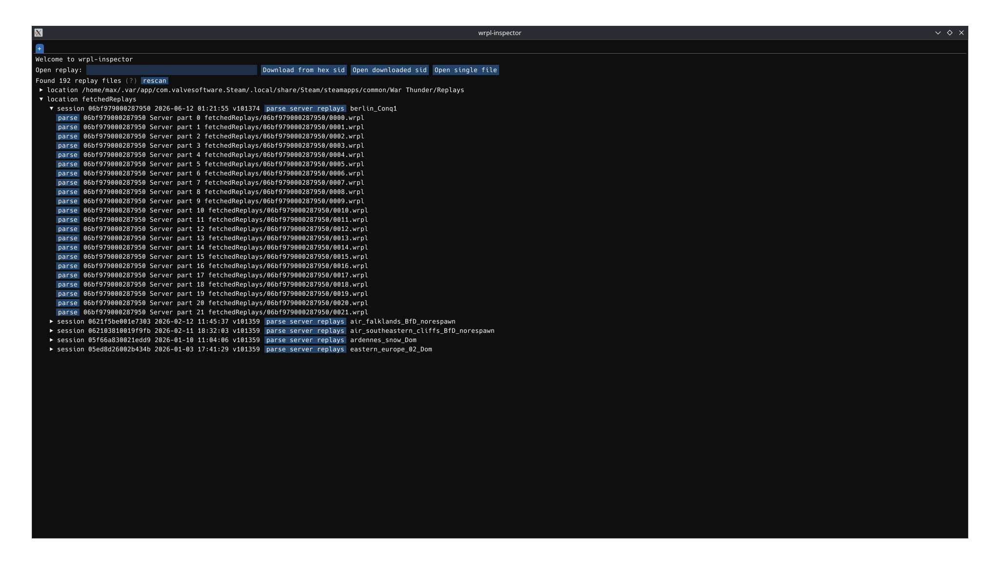

# wrpl-inspector

A golang library and dear-imgui ui to explore War Thunder replay format

## Project structure

Project has 2 components:

inspector - application gui library where you can toy around with the replays, view packets and interact with parser results (with pluggable gui tabs)

wrpl - standalone library for parsing replays (with pluggable parsers)

## Usage

Do `go build` in `cmd/inspector` directory to get a sample application that launches inspector gui.

## Capabilities

> [!IMPORTANT]
> Information provided may be incomplete/innacurate.
> If you want to propose imporvements feel free to open issue, pull request or contact me via Discord @flexcoral (343418440423309314) ([invite](https://discord.com/invite/DFsMKWJJPN)).

- Basics
  - Parsing most of the static binary header
  - Showing settings BLK (if present)
  - Showing results BLK (if present)
  - Opening and parsing packet stream
  - Opening multiple individual replay files at the same time
- Server replays
  - Downloading server replay from session ID
  - Opening segmented server replay and combining them
- Packets
  - Chat
  - Most of ECS system (by LivingTheDagor)
  - Awards
  - Kills
  - Full precision ground unit movement packets
  - Aircraft state (by LivingTheDagor)
  - Camera angles
  - Critical and fatal damage
  - Player information
- Features
	- Kill log
	- Map view

## TODOs

- Packet diffing, generally capability for easier comparing of packets from replay to replay
- Potentially syncing packets and video stream for better context awareness in packet view

## Contributing

If you wrote a gui tab or a parser feel free to open pull request.
A lot of work was done in private repository with no plans on publishing, if you want
to take a look at it or ask questions feel free to contact me.

## Credits

This project would've not been here if StatShark devs didn't troll me in their discord, but on a serious note big thanks to:
- [Sgambe33's WT-Plotter](https://github.com/Sgambe33/WT-Plotter) (C++) (general motivation, head start)
- [wt_blk](https://github.com/Warthunder-Open-Source-Foundation/wt_blk) (Rust) (parsing BLK blobs)
- [llama-for3ver's wt_replay_decoder](https://github.com/llama-for3ver/wt_replay_decoder) (Rust) (parsing packet stream)

Inspector was developed to it's current capabilities in tandem with LivingTheDagor, who also started to publish
some of his work in [his repository](https://github.com/LivingTheDagor/WrplReplayParser).

## License

Both ui and lib (wrpl) are under GNU Affero General Public License v3

In repository root there is a TTF font (HackNerdFontMono-Regular.ttf) that is
not part of wrpl-inspector distribution and is provided for easier setup until
cimgui-go figures out the backends so that default font renders all the utf segments.
It is licensed with Bitstream-Vera and MIT.

wrpl-inspector and wrpl library are not affiliated with or endorsed by
Gaijin Entertainment. War Thunder is a registered trademark of Gaijin Entertainment. All rights reserved.
